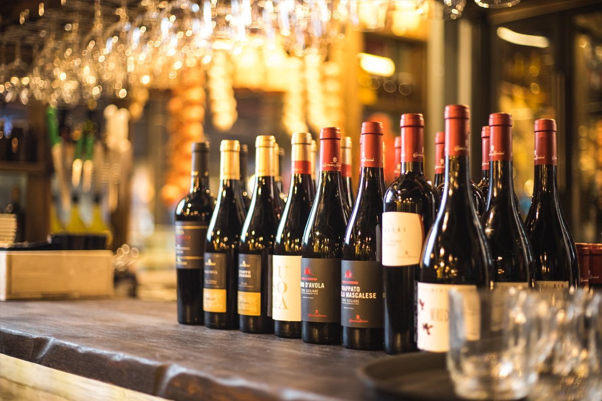

# ADS Project 5: Free-Topic Final Project



Term: Fall 2018

+ Team #5

+ Projec title: Wine Review

+ Team members
	+ Gao, Han (hg2474)
	+ Mu, Jianping (jm4610) -- presenter
	+ Wang, Nannan (nw2387)
	+ Zhong, Qingyang (qz2317)
	
+ Project summary: 

    + In this project, we develop an analysis about wine. 
    + First we get our data from Kaggle and then is the exploratory data analysis part. In the EDA part, we convert the description of each entry that included in dataset to 24 features which we can analysis in the proceeding steps. So we have one response variable is price, and we have other 24 explanatory variables. 
    + After that we use two different algorithms,both unsupervised learning, KNN and Balltree, to explore the relationship between the price of wine and our features.
	
**Contribution statement**: ([default](doc/a_note_on_contributions.md)) All team members contributed equally in all stages of this project. All team members approve our work presented in this GitHub repository including this contributions statement. 

Following [suggestions](http://nicercode.github.io/blog/2013-04-05-projects/) by [RICH FITZJOHN](http://nicercode.github.io/about/#Team) (@richfitz). This folder is orgarnized as follows.

```
proj/
├── lib/
├── data/
├── doc/
├── figs/
└── output/
```

Please see each subfolder for a README file.
